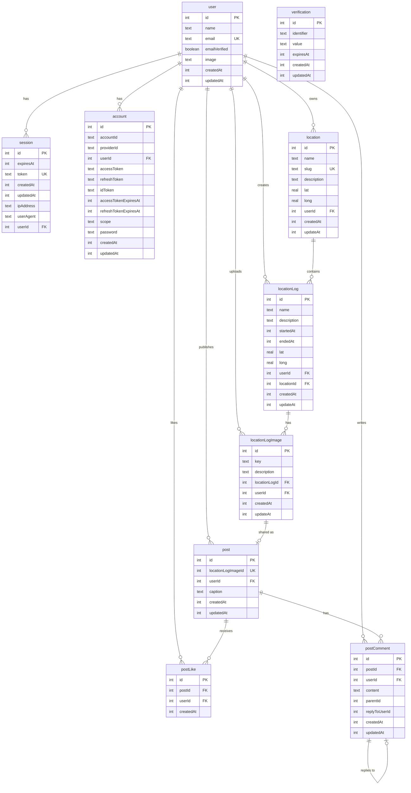

# 📊 Database Schema — WanderLog

## ER Diagram

---

## 📋 Таблицы по областям

### 🔐 Auth (Better Auth)

| Таблица        | Описание                        |
| -------------- | ------------------------------- |
| `user`         | Пользователи системы            |
| `session`      | Активные сессии                 |
| `account`      | OAuth аккаунты (GitHub, Google) |
| `verification` | Токены подтверждения            |

### 📍 Locations (Места путешествий)

| Таблица            | Описание                          |
| ------------------ | --------------------------------- |
| `location`         | Основные места (города, страны)   |
| `locationLog`      | Записи о посещениях с датами      |
| `locationLogImage` | Фотографии, привязанные к записям |

### 📱 Social (Социальная лента)

| Таблица       | Описание                     |
| ------------- | ---------------------------- |
| `post`        | Публикации в ленте (из фото) |
| `postLike`    | Лайки к постам               |
| `postComment` | Комментарии с ответами       |

---

## 🔗 Ключевые связи

| Связь                              | Тип  | Описание              | ON DELETE |
| ---------------------------------- | ---- | --------------------- | --------- |
| `user` → `session`                 | 1:N  | Сессии пользователя   | CASCADE   |
| `user` → `account`                 | 1:N  | OAuth аккаунты        | CASCADE   |
| `user` → `location`                | 1:N  | Места пользователя    | CASCADE   |
| `location` → `locationLog`         | 1:N  | Записи в месте        | CASCADE   |
| `locationLog` → `locationLogImage` | 1:N  | Фото в записи         | CASCADE   |
| `locationLogImage` → `post`        | 1:1  | Публикация фото       | CASCADE   |
| `post` → `postLike`                | 1:N  | Лайки                 | CASCADE   |
| `post` → `postComment`             | 1:N  | Комментарии           | CASCADE   |
| `postComment` → `postComment`      | self | Ответы на комментарии | -         |

---

## ⚠️ Уникальные ограничения

| Таблица    | Constraint                    | Поля                 |
| ---------- | ----------------------------- | -------------------- |
| `user`     | `user_email_unique`           | `email`              |
| `session`  | `session_token_unique`        | `token`              |
| `location` | `location_slug_unique`        | `slug`               |
| `location` | `location_name_userId_unique` | `name`, `userId`     |
| `post`     | unique                        | `locationLogImageId` |
| `postLike` | unique                        | `postId`, `userId`   |
